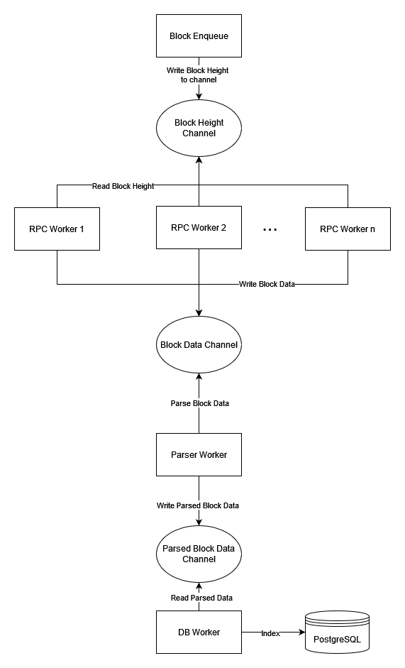

# Application Workflow

The application uses a multi-processing workflow to achieve the following:

1. Splitting of concerns along different data processing pipelines
2. Easier to follow application execution

## System Workflow Diagram

## Block Enqueue

The Block Enqueue worker's only responsibility is to write blocks for processing along a block height channel. Creating this as a separate worker has the following intentions:

1. Handling complex logic for what blocks to enqueue - allows for more fine-grained control over which blocks get indexed
2. Managing the rate of block enqueue - allows throttling the entire application to slow down block processing if needed

The block enqueue functionality is currently customizeable in a number of ways. There are built-in block enqueue functions that are driven by configuration options passed in the command line or config files. However, block enqueue is entirely overwriteable with new functionality for custom block enqueue functions.

## RPC Workers

The RPC Workers are responsible with gathering raw data from the RPC nodes based on the current application configuration requirements. The application allows configuring a number of RPC Workers in parallel, which will allow the data for multiple blocks to gathered at the same time. Isolating RPC requests to this set of workers has the following intentions:

1. External network requests are the biggest application bottleneck, running them concurrently on a number of blocks at once can reduce this pressure
2. The number of concurrent workers can be increased/decreased based on how many requests the application should be making at the same time
3. Gathering of raw data in one location for later parsing

## Parser Worker

The parser worker is responsible for taking the raw, on-chain data from the RPC Workers and transforming it into application-specific types. This is used in particular to transform the raw RPC data into the database types for later database indexing. The parser worker handles database-specific data transform requirements. It also handles filtering mechanisms for reducing the size of the dataset for indexing based on configuration requirements.

## DB Worker

The database worker is responsible for inserting the parsed application types into the database. It is responsible for building up the data associations according to the data schema defined by the application.
