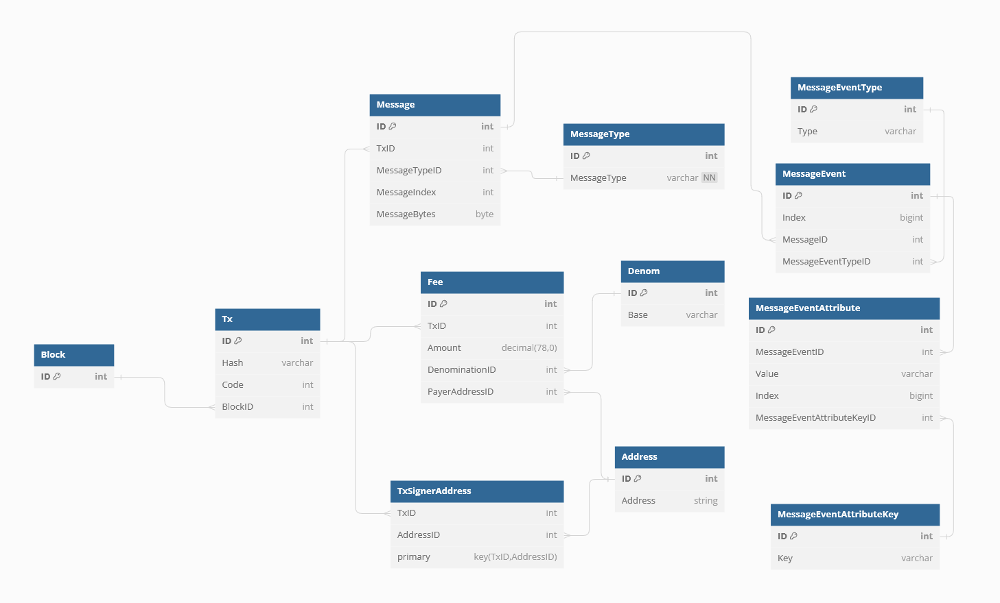

# Transactions Indexed Data

The application indexes Transactions and the Messages that are executed in them into a well-structured data shape. In this section, you will find an overview of what Transactions and Messages are and how they are indexed by the application.

## Anatomy of a Transaction and its Messages

### Transactions

In Cosmos, every block has a list of transactions that are executed. Each transaction has any number of messages attached that define the actions that are executed in the transaction.

When transactions for a block are requested through RPC, the returned dataset has the following shape (from the GetTxsEvent RPC service endpoint):

```json
{
    "txs": [
        "body": {
            "messages": [
                {
                    "type_url": "<message type url>",
                    "value": "<protobuf encoded message>"
                },
                ...<more messages>
            ]
        }
    ],
    "tx_responses": [
        {
            "code": "<response code>",
            "logs": [<event logs>],
        },
        ...<more responses>
    ]
}
```

Each item in the `txs` array is a transaction that was executed in the block. Each transaction has a `body` field that contains the messages that were executed in the transaction.

The `tx_responses` array contains the response data for each transaction. The `code` field contains the response code for the transaction and the `logs` field contains the event logs that were emitted during the transaction execution.

### Transaction Messages

Transaction messages have the following data shape:

```json
{
    "type_url": "<message type url>",
    "value": "<protobuf encoded message>"
}
```

Each message has a `type_url` field that indicates the type of message that was executed. The `value` field contains the protobuf encoded message, which contains message-specific data.

### Message Events and Attributes

When a message is executed, it emits events that are logged in the transaction response. Each event has a set of attributes that provide additional context about the event.

The event data shape is as follows:

```json
{
    "type": "<event type>",
    "attributes": [
        {
            "key": "<attribute key>",
            "value": "<attribute value>"
        },
        ...<more attributes>
    ]
}
```

## Indexing Transactions and Messages

The application indexes transactions and their messages into a well-structured data shape. For implementation details, see the [transactions.go](https://github.com/DefiantLabs/cosmos-indexer/blob/main/db/models/tx.go) file in the models package.

The indexed dataset has the following general overview:

1. Transactions are indexed per Block
   1. Transaction Fees are indexed per Transaction
   2. Transaction Signers are indexed per Transaction
2. Messages are indexed per Transaction
   1. Each message is indexed with the following data:
       - `type_url`: The type of message that was executed
       - `value`: The protobuf encoded message
3. Message Events are indexed per Message
4. Message Event Attributes are indexed per Message Event

See the below database diagram for complete details on how the data is structured and what relationships exist between the different entities.


